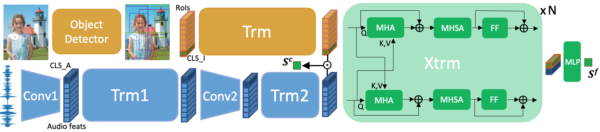
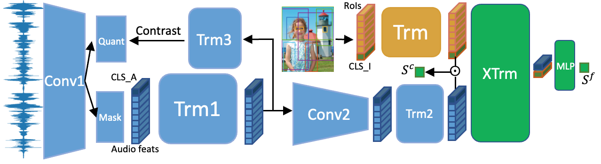

Code for Transformer-based visually grounded speech models:

FaST-VGS:

FaST-VGS+:


Used in the following two papers:

```
@inproceedings{peng2022fastvgs,
  title={Fast-Slow Transformer for Visually Grounding Speech},
  author={Peng, Puyuan and Harwath, David},
  booktitle={Proceedings of the 2022 International Conference on Acoustics, Speech and Signal Processing},
  year={2022}
}

@inproceedings{peng2022fastvgsplus,
  title={Self-Supervised Representation Learning for Speech Using Visual Grounding and Masked Language Modeling},
  author={Peng, Puyuan and Harwath, David},
  booktitle={The Self-Supervised Learning for Speech and Audio Processing Workshop at AAAI 2022},
  year={2022}
}
```
## 0. Clone repo and install requirements
Please git clone this repo, and install the required libraries in `./requirements.txt`. Please note that we also need to install `fairseq==0.10.2`.

## 1. Model weights
Can be found [in this folder](https://drive.google.com/drive/folders/1AOSXSaEgP8vnBR3cjLI7k_IYsFk_uZD3?usp=sharing)

## 2. Use the trained model
```python
import sys
import os
import pickle
# sys.path.append("the path to FaST-VGS-Family") # might not need this depends on your working dir
model_path = "path to weights and args you download in 1."
import torch
from models import fast_vgs, w2v2_model
# load args
with open(f"{model_path}/args.pkl", "rb") as f:
    args = pickle.load(f)
# load weights
weights = torch.load(os.path.join(model_path, "best_bundle.pth"))

# if want to use the entire model for e.g. speech-image retrieval (need to first follow section 3 below)
dual_encoder = fast_vgs.DualEncoder(args)
cross_encoder = fast_vgs.CrossEncoder(args)
dual_encoder.load_state_dict(weights['dual_encoder'])
cross_encoder.load_state_dict(weights['cross_encoder'])

# if only want to use the audio branch for e.g. feature extraction for speech downstream tasks
# if you are loading fast-vgs features, it will say that weights of layer 8-11 (0-based) are not seed_dir, that's fine, because fast-vgs only has first 8 layers (i.e. layer 0-7) of w2v2 model, last four layers will be randomly initialized layers
model = w2v2_model.Wav2Vec2Model_cls(args)
model.carefully_load_state_dict(weights['dual_encoder']) # will filter out weights that don't belong to w2v2

# Note that the input to the model should be normalized
import SoundFile as sf
import torch
import numpy as np
x, sr = sf.read(wav_path, dtype = 'float32')
assert sr == 16000
x_norm = (x - np.mean(x)) / np.std(x)
x = torch.FloatTensor(x_norm).unsqueeze(0)

# example of using the audio branch for feature extraction (model is a instance of w2v2_model.Wav2Vec2Model_cls), from layer 7 (0-based)
model_out = model(source=x, padding_mask=None, mask=False, features_only=True, superb=False, tgt_layer=7)
# model_out is a dictionary contains cls_token, layer_feats, padding_mask
```
*to get zerospeech2021 results of FaST-VGS+, use phonetic: Trm1 layer 6, lexical: Trm1 layer 8, syntactic Trm1 layer 8, semantic Trm2 layer 1 (layer number starts from 1)
**For speech-image retrieval or training models from scratch, please follow the steps below**
## 3. Download data

### Image
Note that for Places and flickr8k, we download the raw images and extract Faster RCNN regional features in the next step, for MSCOCO, we directly download the Faster RCNN feature distributed by [Hao Tan](https://www.cs.unc.edu/~airsplay/) in [LXMERT](https://github.com/airsplay/lxmert).

```bash
data_root="root for storing data"

# COCO
# images train2014 (17 GB) and val2014 (8 GB)
coco_root=${data_root}/coco
mkdir ${data_root}/coco
wget https://nlp.cs.unc.edu/data/lxmert_data/mscoco_imgfeat/train2014_obj36.zip -P ${coco_root}/mscoco_imgfeat
unzip ${coco_root}/mscoco_imgfeat/train2014_obj36.zip -d ${coco_root}/mscoco_imgfeat && rm ${coco_root}/mscoco_imgfeat/train2014_obj36.zip
wget https://nlp.cs.unc.edu/data/lxmert_data/mscoco_imgfeat/val2014_obj36.zip -P ${coco_root}/mscoco_imgfeat
unzip ${coco_root}/mscoco_imgfeat/val2014_obj36.zip -d -d ${coco_root}/mscoco_imgfeat && rm ${coco_root}/mscoco_imgfeat/val2014_obj36.zip
# spoken captions (64G)
wget https://data.csail.mit.edu/placesaudio/SpokenCOCO.tar.gz -P ${coco_root}
cd ${coco_root}
tar -xf SpokenCOCO.tar.gz


# Places 
# Images
# follow http://places.csail.mit.edu/downloadData.html

# spoken captions (85G)
places_root=${data_root}/places
wget https://data.csail.mit.edu/placesaudio/placesaudio_2020_splits.tar.gz -P ${places_root}
cd ${places_root}
tar -xf placesaudio_2020_splits.tar.gz


# Flickr8k
flickr8k_root=${data_root}/flickr8k
# images
# download e.g. from https://www.kaggle.com/adityajn105/flickr8k/activity

# spoken captions 
wget https://groups.csail.mit.edu/sls/downloads/flickraudio/downloads/flickr_audio.tar.gz -P ${flickr8k_root} 
cd ${flickr8k_root}
tar -xf flickr_audio.tar.gz
```

Note that for SpokenCOCO, we (and the models we compared with in the FaST-VGS paper) use the Karpathy split, which can be downloaded online at e.g. [https://www.kaggle.com/shtvkumar/karpathy-splits](https://www.kaggle.com/shtvkumar/karpathy-splits). After downloading it use the scripts in `./datasets/preprocessing/unroll_coco.py` to unroll it into a flat list.

## 4. Image feature preprocessing
We first extract Faster RCNN features using the Docker image released by Hao Tan. The instructions are at https://github.com/airsplay/lxmert#faster-r-cnn-feature-extraction, see section "Yet Another Example: Feature Extraction for MS COCO Images" for how the MSCOCO features are extracted. I put feature extraction scripts for Places and Flickr8k in `./datasets/preprocessing/extract_faster_rcnn` in this repo. Please mount this folder in Docker so it's easier for your to do Faster RCNN feature extraction.

After the the features are extracted,  we can generate hdf5 and other files directly used by the dataset scripts. Change the roots in `./datasets/generate_hdf5_coco_places_flickr8k_imgfeat.py` and run this file.

## 5. Training scripts
need to first download w2v2 base weights
```bash
fb_w2v2_weights_dir="put the dir here"
wget https://dl.fbaipublicfiles.com/fairseq/wav2vec/wav2vec_small.pt
```
Please find the scripts for training FaST-VGS and FaST-VGS+ in `./scripts`.


### Acknowledgement
Model code uses the [wav2vec2 code](https://github.com/pytorch/fairseq/blob/main/examples/wav2vec/README.md) from [fairseq](https://github.com/pytorch/fairseq) and [LXMERT code](https://github.com/airsplay/lxmert) from [Hao Tan](https://www.cs.unc.edu/~airsplay/).